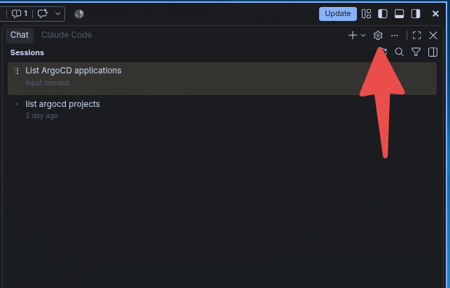
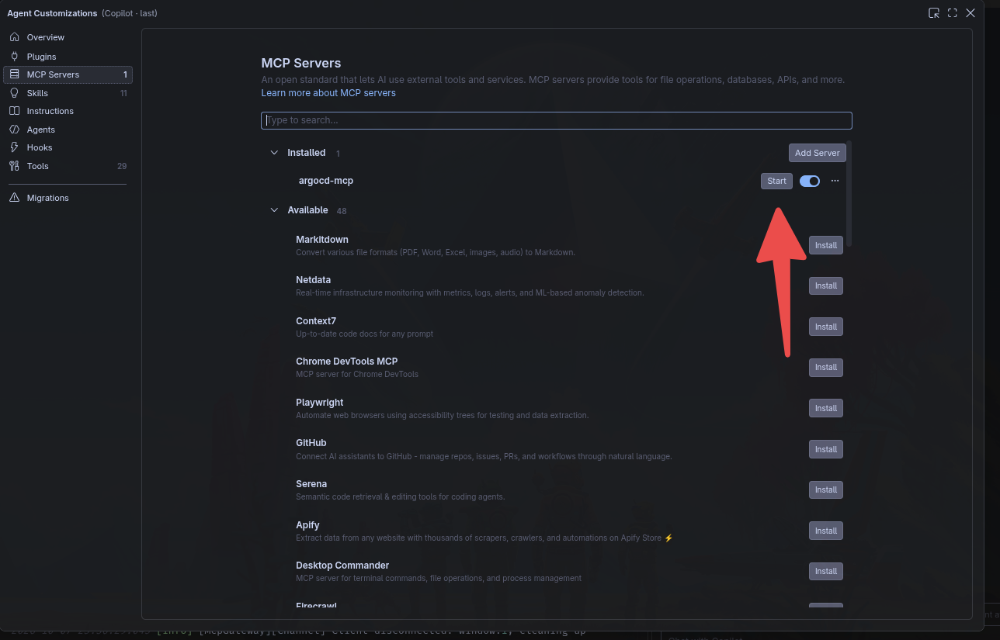

This lab covers three AI / automation integrations for Kubernetes:

1. **K8sGPT** – AI-powered cluster analysis and remediation suggestions
2. **BotKube** – Interactive `kubectl` via Slack
3. **Argo CD MCP Server** – Query Argo CD from VS Code / AI assistants

Prerequisites:

- Access to the lab AKS cluster
- Valid `~/.kube/config`
- `helm`, `kubectl`, and VS Code installed

---

## 1. K8sGPT

### 1.1 Install K8sGPT

```bash
curl -LO https://github.com/k8sgpt-ai/k8sgpt/releases/latest/download/k8sgpt_amd64.deb
sudo dpkg -i k8sgpt_amd64.deb
```

### 1.2 Configure AI Backend (Azure Foundry Model)

```bash
k8sgpt auth add \
  --backend openai \
  --baseurl "https://argo-gpt.services.ai.azure.com/models" \
  --model DeepSeek-V4-Flash \
  --password "<your-foundry-api-key>"
```

Then set it as the default backend:

```bash
k8sgpt auth default -p openai
k8sgpt auth list
```

> Get the API key and model name from `class.env`. Do not commit keys to Git.

### 1.3 Analyze the Cluster

Basic analysis for a namespace:

```bash
k8sgpt analyze --namespace $NAMESPACE
```

List available filters:

```bash
k8sgpt filters list
```

Filtered analysis with AI explanation:

```bash
k8sgpt analyze --namespace $NAMESPACE --filter Pod --explain --anonymize
```

> The `--anonymize` flag masks sensitive cluster data before sending payloads to the external AI backend.

---

## 2. BotKube

BotKube brings interactive `kubectl` to your messaging platform. In this lab we use Slack.

Executor plugins allow you to run actions (e.g. `kubectl`, `helm`) directly from a Slack channel, while source plugins stream read-only events and recommendations into Slack. This is intended for platform engineers and on-call SREs who want faster incident triage without leaving chat.

### 2.1 Setup Slack App

[Document for Slack Setup](https://docs.botkube.io/installation/slack/)

### 2.2 Install BotKube via Helm

```bash
export SLACK_API_APP_TOKEN="<your-slack-app-token>"
export SLACK_API_BOT_TOKEN="<your-slack-bot-token>"

# 1. Add the official BotKube Helm repository
helm repo add botkube https://charts.botkube.io

# 2. Update your local Helm chart cache
helm repo update

# 3. Install / upgrade BotKube
helm upgrade botkube botkube/botkube \
  --namespace botkube --create-namespace \
  --set settings.clusterName="ai-sre-lab-aks" \
  --set communications.default-group.socketSlack.enabled=true \
  --set communications.default-group.socketSlack.channels.default.name="bot-kube" \
  --set communications.default-group.socketSlack.appToken=${SLACK_API_APP_TOKEN} \
  --set communications.default-group.socketSlack.botToken=${SLACK_API_BOT_TOKEN} \
  --set 'executors.k8s-default-tools.botkube/kubectl.enabled'=true \
  --set communications.default-group.socketSlack.channels.default.bindings.executors='{k8s-default-tools}' \
  --set communications.default-group.socketSlack.channels.default.bindings.sources='{k8s-err-events,k8s-recommendation-events}'
```

Try from the `#bot-kube` Slack channel, for example:

```text
@BotKube kubectl get pods -n <namespace>
@BotKube kubectl describe pod <pod-name> -n <namespace>
```

---

## 3. Argo CD MCP Server

The Argo CD MCP server exposes specific Argo CD operations to your AI assistant. For example, a `get_projects` tool runs `argocd get projects` behind the scenes on the remote server.

### 3.1 Create VS Code MCP Config

```bash
mkdir -p .vscode
```

Create `.vscode/mcp.json`:

```bash
cat .vscode/mcp.json <<'EOF'
{
  "inputs": [
    {
      "type": "promptString",
      "id": "argocd-token",
      "description": "Argo CD API token (<id>-mcp from class.env)",
      "password": true
    }
  ],
  "servers": {
    "argocd-mcp": {
      "type": "stdio",
      "command": "npx",
      "args": ["-y", "argocd-mcp@0.9.0", "stdio"],
      "env": {
        "ARGOCD_BASE_URL": "https://135.235.144.138",
        "ARGOCD_API_TOKEN": "${input:argocd-token}",
        "NODE_TLS_REJECT_UNAUTHORIZED": "0"
      }
    }
  }
}
EOF
```

### 3.2 Enable in VS Code

1. Open VS Code **Settings**.
2. Go to the **MCP Servers** section.



3. Enable `argocd-mcp`.



### 3.3 Try It

Ask your assistant, for example:

```text
How many applications deployed via Argo CD are in an error condition?
```
